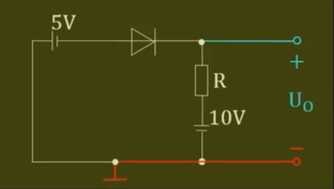

+++
author = "zuimu"
title = "单个二极管状态分析"
date = "2022-11-06"
description = "判断是否导通和求输出电压Uo"
categories = [
    "模电"
]
tags = [
    "模电","期末"
]

+++

# 单个二极管状态分析

## 1.电路完整的话跳过1，电路不完整：

 

例如：

变成了

## 2.没什么好说的把二极管变成——阳极    断开    ——阴极

## 3.分析两极电位

例如：这个

变成了

## 4.判断阳极减阴极是否大于导通电压（导通电压题目没说就是0）

阳-阴>Ud 二极管导通   

阳-阴<Ud 二极管截止

## 5.若二极管截止，跳过5

若二极管导通，则        <u>阳极        </u>    <u>阴极</u>      变成

3分析的电位作废

## 6.只分析Uo两端电压【用3】

输出电压=正电位-（负电位）

## 7.总结

